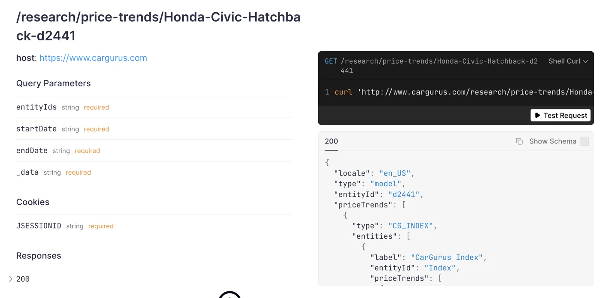

# Monarch Money Car Value Tracker - Claude

## 🧑 Human

I want you to help me plan out a programming project. I want to flesh out the idea and use case so i can pass this onto claude code.

I use monarch money for managing my personal finances. It allows you to track the value of your assets such as vehicles. I want to create some script or program that will extract the car value data from Car Guru's website so I can use it to set the value of my car.

Car Gurus has charts where you can specify your vehicle and a date range and get the value back. you can see data for the previous year. If you look within the window of 1 month, the data is pretty granular, but if you stretch the window all the way out to the year, the data points get less granular.

The program will need to make multiple calls at the monthly granularity and put that data together to get the full history.

This is an example of getting one month of data from 7/1/25 to 8/1/25 for a 2022 honda civic hatchback: https://www.cargurus.com/research/price-trends/Honda-Civic-Hatchback-d2441?entityIds=c32015&startDate=1751342400000&endDate=1754107199999

I want the end data to be formatted in a way that I can upload to Monarch. Monarch's format of vehicle value history looks like this:

```
Date,Balance,Account
2022-01-19,32390.75,2022 Honda Civic EX-L
2022-01-20,32390.75,2022 Honda Civic EX-L
2022-01-21,32390.75,2022 Honda Civic EX-L
```

Ask me questions about any holes you see with this plan. Lets work together to put together a set of specs that can be used by Claude code to bring this idea to fruition

---

## 🤖 Claude

This is a really practical project! I can see how automating car value updates would save you time and keep your Monarch data current. Let me break down what I understand and ask some clarifying questions to help create solid specs for Claude Code.

### What I understand so far:

- Extract car value data from CarGurus price trend charts
- Handle the granularity issue by making multiple monthly API calls
- Format output as CSV compatible with Monarch Money's import format
- Target vehicle: 2022 Honda Civic Hatchback

### Questions to flesh out the specifications:

**Technical Implementation:**

1. Data extraction method : Are you thinking web scraping the chart data, or have you noticed if CarGurus has any API endpoints we could use? The URL structure suggests they might have a JSON API behind those charts.
2. Date range strategy : For the full year of data, should the script automatically break it into 12 monthly chunks, or do you want to specify custom date ranges?
3. Data frequency : In the monthly view, how often do the data points appear? Daily? Weekly? This will affect how we interpolate the data for Monarch's daily format.

**Output & Integration:**

1. Multiple vehicles : Do you envision this working for just one car, or should it be designed to handle multiple vehicles in your household?
2. Data handling : When CarGurus shows a value for, say, July 15th, should we fill in the same value for all days until the next data point, or interpolate between points?

**Practical Considerations:**

1. Update frequency: How often do you plan to run this - monthly, quarterly, or on-demand?
2. Error handling : What should happen if CarGurus changes their URL structure or if there are gaps in their data?
3. Authentication : Does CarGurus require any login or have rate limiting we should be aware of?

What's your thinking on these points? Also, have you looked at the network tab in your browser to see what actual API calls CarGurus makes when loading those charts?

---

## 🧑 Human

- great point. I just used openapi-devtools to get an openapi specification for the API that sends the data for the chart!
- I want to be able to specify an arbitrary date range and have the script handle breaking it into monthly chunks. it shouldn't allow me to choose a start date older than a year.
- it looks like the data is daily when you get down to the month level or smaller
- The account field should be configurable, but i'm just using this for myself so it's fine if it needs the user to provide the car model snippet from the cargurs url manually
- I only need this for one car right now. just going for an MVP, no need to expand too much
- filling days with the previous value if we don't have a new one is fine
- if there are errors, the script should fail with a helpful message
- authentication; i'm not sure. i'm attaching an image of the endpoint that the openapi devtools was able to sniff out

(attached)


---

## 🤖 Claude

Perfect! The OpenAPI devtools discovery is a game-changer - this makes the project much more reliable than web scraping. Based on your screenshot, I can see the API structure clearly.

### Refined Project Specifications

**Core Functionality:**

- Script takes user inputs: start date, end date, car model URL snippet, and account name
- Validates date range (max 1 year back from current date)
- Automatically chunks date range into monthly segments
- Makes API calls to CarGurus endpoint for each month
- Combines data and fills gaps with previous values
- Outputs Monarch-compatible CSV

**API Details from your screenshot:**

- Endpoint: `GET /research/price-trends/Honda-Civic-Hatchback-d2441`
- Required params: `entityIds` , `startDate` , `endDate` , `_data`
- Requires `JSESSIONID` cookie
- Returns JSON with `priceTrends` array containing daily data points

**A few clarifying questions:**

1. Session handling : Since it requires `JSESSIONID` , should the script prompt you to manually grab a session cookie from your browser, or do you want it to attempt to establish a session first?
2. Date format : The timestamps in your example URL look like Unix milliseconds. Should the script accept human-readable dates (like "2024-07-01") and convert them?
3. Entity ID extraction : From your URL example, I see `entityIds=c32015` and the path has `d2441` . Should the script parse both of these from the CarGurus URL you provide, or do you want to specify them separately?
4. Output location : Should it save the CSV to a specific filename/location, or just output to stdout?
5. Error scenarios : What should happen if CarGurus returns no data for certain date ranges, or if the API structure changes?

The `_data` parameter in the API is interesting - do you know what value that expects, or should we examine the actual network request more closely?
This looks very doable once we nail down these details!

---

## 🧑 Human

- prompting for cookies manually is fine
- the script should accept human readable time
- i'm not quite sure that the entityids part is for; we'll likely need to analyze the output from the api... I'm attaching a snippet. the d2241 from the url path can be provided by the user
- output to csv
- if cargurs returns no data, fill forward with the last known data point. if there's absolutely no data, just error out
- this is what the devtools put in the `_data` field when I tested a request: `routes/($intl).research.price-trends.$makeModelSlug`

[pasted in sample-api-response](sample-api-response.json)

---

## 🤖 Claude

Excellent! This JSON response gives us a much clearer picture of the API structure. Looking at your data, I can see exactly what we need to extract.

### Key Insights from the API Response:

**Data Structure:**

- The `pricePointsEntities` array contains the daily price data we need
- Each entity has an `entityId` (like "c32015" for 2022 Civic Hatchback) and pricePoints array
- Price points have `date` (Unix timestamp in milliseconds) and `price` values
- The `tw` values in other sections represent "time windows" (0=today, 30=30 days ago, etc.) - not what we need

**Entity ID Discovery:**
From your example, the 2022 Honda Civic Hatchback has entityId: `"c32015"`, which matches the `entityIds=c32015` in your original URL. So users will need to provide this specific entity ID.

## Final Project Specifications:

**Input Parameters:**

1. CarGurus entity ID (e.g., "c32015")
2. Model path segment (e.g., "Honda-Civic-Hatchback-d2441")
3. Start date (human readable, e.g., "2024-01-01")
4. End date (human readable, e.g., "2024-12-31")
5. Account name for CSV output (e.g., "2022 Honda Civic EX-L")
6. JSESSIONID cookie value

**Technical Implementation:**

- Validate date range (max 1 year back, start < end)
- Convert dates to Unix milliseconds
- Break date range into monthly chunks
- For each month, call: `GET /research/price-trends/{modelPath}?entityIds={entityId}&startDate={start}&endDate={end}&\_data=routes/($intl).research.price-trends.$makeModelSlug`
- Extract data from `pricePointsEntities[0].pricePoints` array
- Convert Unix timestamps back to YYYY-MM-DD format
- Fill gaps with forward-fill logic
- Output CSV in Monarch format

**Error Handling:**

- Missing `pricePointsEntities` or empty `pricePoints` → forward-fill from last known value
- Network errors → fail with descriptive message
- Invalid date ranges → fail with validation message

**Output:**
CSV file named something like `{modelName}_{startDate}_{endDate}_values.csv`

Does this capture everything correctly? The main remaining question is whether you want the script to automatically figure out the model path from the entity ID, or if you're fine manually providing both the entity ID and the model path segment when running the script?

---

## 🧑 Human

yeah that captures it perfectly. i don't want to worry about too much automated discovery right now. it's easy to grab those things from the url

---

## 🤖 Claude

Perfect! This gives us a clean, focused MVP that gets the job done without overengineering. Here's the complete specification for Claude Code:

[generated spec.md](spec.md)

There you have it! This specification gives Claude Code everything it needs to build your CarGurus scraper. The scope is focused and practical - no over-engineering, just a solid tool that does exactly what you need.
A couple of implementation notes that might be helpful when you hand this off:

The monthly chunking logic will be the most complex part, but it's straightforward date math
The forward-fill strategy handles CarGurus' inconsistent data availability gracefully
Error handling covers the main failure modes you're likely to encounter

Once Claude Code builds this, you'll be able to run it whenever you want to update your car's value in Monarch Money. Pretty slick automation for personal finance tracking!

---
